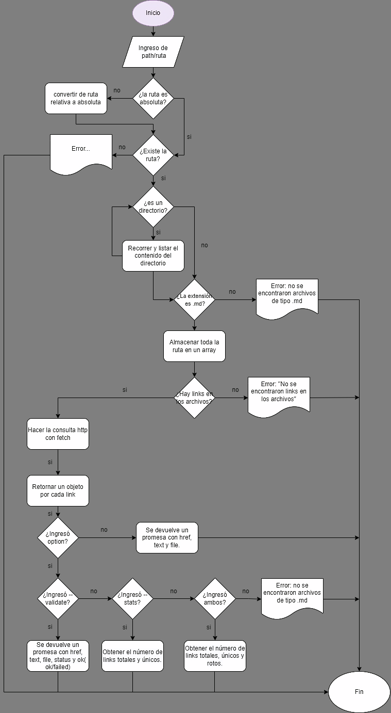

# Markdown Links

## Índice

- [1. Definición del proyecto](MD-LINKS.png.#1-definición-del-proyecto)
- [2. Instalación](#2-instalación)
- [3. Guía de uso](#3-guía-de-uso)
- [4. Consideraciones generales](#4-diagrama-de-flujo)
- [5. Construido con](#5-construido-con)
- [6. Libraries](#6-libraries)
- [7. Autor](#7-autor)
---
## 1. Definición del proyecto

Librería que permite analizar los links que se encuentran en archivos de formato Markdown de cada directorio, obteniendo la información del estado, la cantidad total, la cantidad no repetida de los links y la cantidad de enlaces rotas.

---
## 2. 👩‍💻 Instalación

Instalar md-links con el siguiente comando:

```bash
$ npm i md-links-jammie
```
---
## 3. Guía de uso
### Ejecución

A travéz de la **terminal**

```bash
md-links <path-to-file> [options]
```
Donde la ruta ingresada puede ser **relativa** o **absoluta**.
Y las opciones son las siguientes:
**--validate**, **--stats** o **ambas**.
### Detalle

`md-links <path-to-file>`: Analiza el archivo Markdown e imprime de forma ordenada primero la ruta del archivo en el que haya links, la url de estos y el texto que exista dentro del link.

`md-links <path-to-file> --validate`: Se hace una petición HTTP para averiguar si el link funciona o no y retorna la información. Valida que estado tiene el link, devolviendo el status (entre 200 y 400 devuelve Ok, mayor a 400 devuelve fail) y ok o file respectivamente.

`md-links <path-to-file> --stats`: Retorna un texto con el número total(Total) de links encontrados y el número de links únicos(Unique).

`md-links <path-to-file> --stats --validate`: retorna un texto con el número total(Total) de links encontrados, el número de links únicos(Unique) y el número de links rotos(Broken).

---
## 4. Diagrama de flujo


---
## 5. 🛠 Skills
_Javascript, Nodejs_
## 6. Libraries
_Fetch, Chalk, File system, Path._
## 7. 🚀 Autor
- [@JammieHurtado](https://github.com/Emmigumi)

